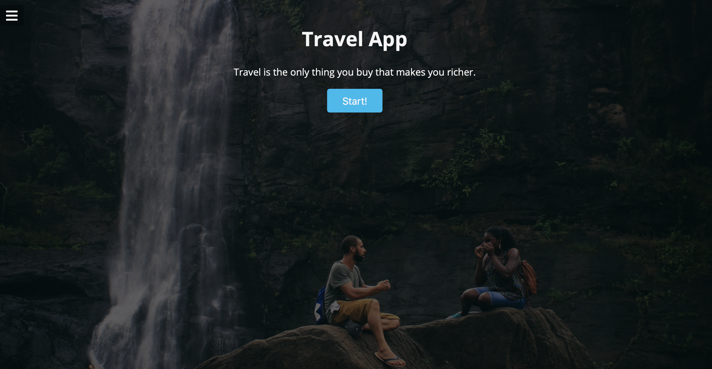
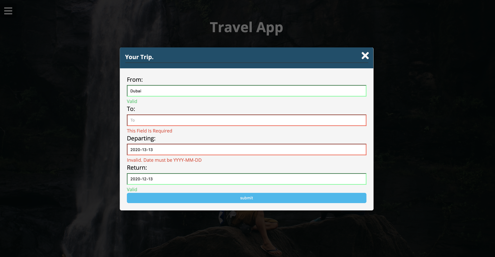

# Travel App FEND Capstone Project

This is a final project for udacity front end nano degree, this project aims to put all of the skills learned skills into one project to build a custom travel app in a Webpack environment, using an express server.

There is a form that retrieve data from the user with validation feedback and then retrieving data from 3 APIs in which one of those is reliant on another to work. The final results shows the user a basic weather condition for the city with pictures  and if there is no pictures then a random images will appear. 

## Project Structure:

```sh
- Root:
	├── .babelrc
	├── .env
	├── .gitignore
	├── README.md
	├── package.json
	├── __test__
	│   ├── formHandling.test.js
	│   ├── routerFunc.test.js
	│   └── server.test.js
	|
	├── src
	│   ├── client
	│   │   ├── images
	│   │   │   ├── [name].png
	│   │   │   ├── [name].png
	│   │   │   └── [name].png
	│   │   ├── index.js
	│   │   ├── js
	│   │   │   ├── formHandling.js
	│   │   │   ├── form_data.js
	│   │   │   └── routerFunc.js
	│   │   ├── styles
	│   │   │   ├── _custom.scss
	│   │   │   ├── home.scss
	│   │   │   └── share.scss
	│   │   └── views
	│   │       └── index.html
	│   └── server
	│       └── index.js
	|
	├── webpack.dev.js
	└── webpack.prod.js

```

### Tools Required

You would require the following tools to develop and run the project:

- A text editor or an IDE (like Visual Studio Code) or Sublime text
- API keys from pixabayKey, weatherbitKey and geonamesUser

### Installation

```sh
$ cd travel_app
$ npm install
$ npm run build-prod && npm start
```

## Overview:




